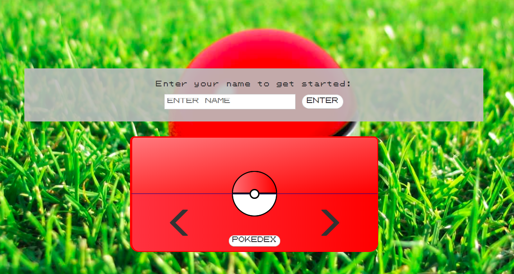

# [Pokédex App](https://kevinlee6.github.io/pokedex/)

A Pokédex designed with mobile responsiveness in mind. Starts with 3 set Pokémon, but able to add more within the app via a hidden button in the pokéball. Utilizes API from [PokéAPI](https://pokeapi.co).

## Pokédex made possible with:

- HTML
- SCSS
  - Bootstrap
- Javascript
  - ES6 Modules
  - Promises and Async/Await
  - Fetch API
- PokéAPI.co's API

## Information available from Pokédex app:

- Name/ID
- HP
- Attack
- Defense
- Abilities
- Type
- Sprite
- Moves
- Height
- Weight

## To run locally

- Clone repo
- Navigate to repo (either in command line or file explorer)
- Open index.html file in your favorite web browser

App available through [https://kevinlee6.github.io/pokedex/](https://kevinlee6.github.io/pokedex/)
