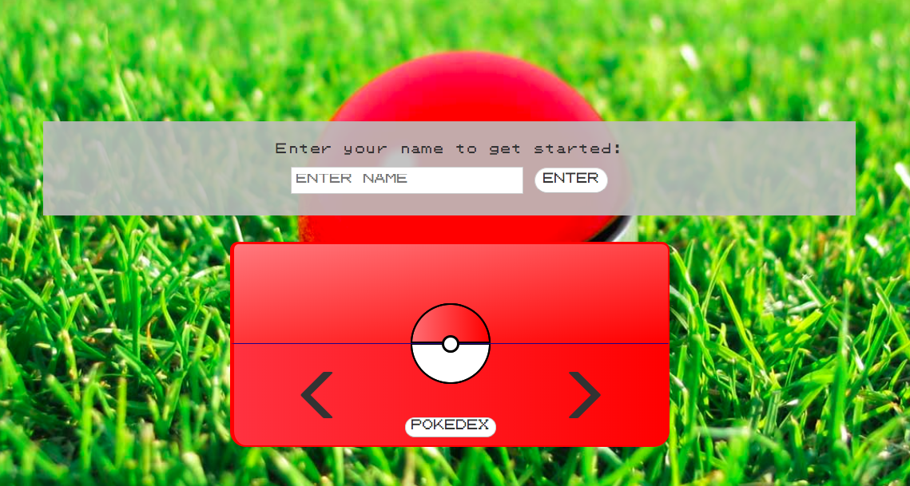

<h1>Pokédex App</h1>

Pokédex made possible with:
    <ul>
        <li>HTML</li>
        <li>SCSS</li>
            <ul>
            <li>Bootstrap</li>
            </ul>
        <li>Javascript</li>
            <ul>
            <li>Axios Library</li>
            </ul>
        <li>pokeapi.co's API</li>
    </ul>

A pokédex designed with mobile responsiveness in mind. Starts with 3 fixed (set) pokémon, but able to add more within the app via a hidden button in the pokéball. Utilizes API from <a href='https://pokeapi.co'>pokeapi.co</a>.

Information available from Pokédex app:
    <ul>
        <li>Name/ID</li>
        <li>HP</li>
        <li>Attack</li>
        <li>Defense</li>
        <li>Abilities</li>
        <li>Type</li>
        <li>Sprite</li>
        <li>Moves</li>
        <li>Height</li>
        <li>Weight</li>
    </ul>

App available through <a href='https://kevin-lee-pokedex.herokuapp.com/'>kevin-lee-pokedex.herokuapp.com</a>.

